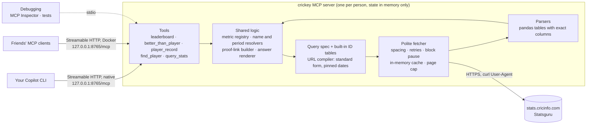

# Plan: `crickey`, an MCP server for Cricinfo Statsguru

## Goal
- Answer cricket statistics questions using only Cricinfo's Statsguru as the data source.
- Every answer includes Cricinfo links that anyone can open to check the numbers and share as proof.
- These golden questions must work:
  1. Average number of innings taken per ODI century (minimum X number of centuries).
  2. Which players have scored Test hundreds more frequently than player X?
  3. Which batters had better average and strike rate in T20 than player X, in the same period that player X played?
  4. What was player X's Test batting average in the last Y years of his career?
  5. How many hundreds has player X scored in ODI World Cups?

## Overview
This plan says how to build crickey to meet the goal. It refers to decisions and research instead of repeating them:
- **Decisions:** [decisions.md](decisions.md), referred to as D1–D26.
- **Research facts:** [research.md](research.md), referred to by section as R1–R16.

## Versions
R15 lists the versions to use (D22).
- `pyproject.toml` sets `requires-python` to R15's Python minor version and, for each dependency, a lower bound at its R15 version and an upper bound below its next major version.
- Actions are pinned to the commit SHAs of R15's releases.

## Architecture

## Statsguru coverage (`query_stats`)
`query_stats` exposes Statsguru's own basic and advanced forms for every stat type, with Statsguru's field names and values (R4) and its minimum and sort options (R5). Nothing is renamed or regrouped. It accepts all three result qualifications that Statsguru supports (R2).

## MCP tools (v1)
Five tools (D14), all read-only.
- **Answer tools** return `answer_markdown` plus structured data. The markdown has a short answer, a table, the method and assumptions, labelled pinned links and profile links (D16), the "as of" date and the freshness line (D17).
- **Ambiguous names** (players, teams, grounds, trophies) return `needs_clarification` with the candidates.
- **Descriptions** start with example questions taken from the golden questions.

1. **`leaderboard`** (golden question 1): "Who has the best or fastest …?"
   - Parameters: format, metric, period, filters by name (team, opposition, host country, ground, trophy, home or away, match result), minimum and top N.
   - Metrics can be Statsguru columns (runs, average, strike rate, hundreds, …) or derived rates (innings per hundred, innings per fifty-plus, balls per dismissal).
   - For a derived rate it also gives the group's overall figure, for example total innings ÷ total hundreds across all qualifying players.
2. **`better_than_player`** (golden questions 2 and 3): "Who beats player X on A (and B)?"
   - Parameters: player name, format, 1–3 metrics, all or any, period (all time, X's career span, or dates), minimum and filters.
   - Includes X's own row. Proof link (D16): the results query with X's values as extra minimums (R2).
3. **`player_record`** (golden questions 4 and 5): one player's figures in a format.
   - Parameters: player name, format, period (whole career, first or last N years of their career, dates or season) and filters (opposition, host country, ground, trophy such as the ODI World Cup, home or away, match result).
   - Proof link: the player's Statsguru page with the same filters (R6).
4. **`find_player`**: candidates with ID, country, formats and career spans (R7).
5. **`query_stats`**: any Statsguru query (see coverage above).
   - Returns up to `limit` rows (default 50, maximum 200), the total row count, exact columns and the pinned link.
   - With `fetch=false` it only builds the link, so no request is made.

Server instructions tell the agent to:
- prefer the answer tools and show `answer_markdown` as-is;
- not do multi-row arithmetic itself (D13);
- cite only links that came from the tools (D16);
- read "T20" as D3 says.

## Calculations (inside the answer tools)
- **Metric registry (batting first):** for each metric it records:
  - the label;
  - the Statsguru column, sort field and qualification field, if Statsguru has the metric;
  - the exact formula from totals, if it's derived;
  - which direction is better, and its default minimum, which is stated in answers.

  Examples: average = runs ÷ (innings − not outs); strike rate = runs ÷ balls × 100; innings per hundred = innings ÷ hundreds.
- **Exact columns:** computed with the registry's formulas and used as D15 requires (R2).
- **Period resolver:**
  - "X's career span" is X's first and last match start dates in that format, from X's innings list (R6).
  - "The last Y years of X's career" runs from Y years before X's last match to that match.

## Proof links and freshness
The proof-link builder implements D16, and the answer renderer D17.
- **Pinned dates:** `spanmin1` is the format's first match date (from the built-in tables) and `spanmax1` is today, unless the question's period is narrower.
- **Final filter in the link:** added through `qualval2` and `qualval3` (R2).
- **Freshness line:** from the results page's list of current or recent matches (R8).
- **Profile links:** built from the player ID in Statsguru's format (R6).

## Built-in IDs
- **Generator:** `scripts/gen_ids.py`, run only by developers, reads the advanced form pages (R4) for each format in D3 and writes the tables D18 lists into a committed Python module. Re-run it by hand when a team or league is added.
- **On demand (D18):** grounds, series and `player_involve`/`captain_involve` IDs are read from the form pages (R4) when a query needs them, and kept in memory.
- **Parameter meanings** live in code and are tested against synthetic form pages.

## Fetcher
Implements D7–D12 and D17.
- **Client:** httpx, with the User-Agent from D12.
- **State per process, in memory:** the rate limiter, retry state and block pause.
- **Cache:** compressed, in memory, keyed by standard URL, with the settled, recent and lookup rules and the size cap.
- **Requests:** the page cap (D10), and progress notifications while waiting.
- **Tests:** a test-only hook serves synthetic pages instead of the network.
- **Settings** (environment variables, or matching flags): `CRICKEY_MIN_INTERVAL`, `CRICKEY_MAX_RETRIES`, `CRICKEY_BLOCK_PAUSES`, `CRICKEY_MAX_PAGES`, `CRICKEY_CACHE_MAX_MB`, `CRICKEY_RECENT_TTL`, `CRICKEY_PORT` and `CRICKEY_IN_CONTAINER`.

## HTTP transport
- **Serving:** `crickey serve`, which plain `crickey` also runs, serves `mcp.streamable_http_app()` with uvicorn on port 8765 (`--port` or `CRICKEY_PORT`), as one process. This is the default mode (D20).
- **Binding:** natively it binds 127.0.0.1 and rejects other addresses. With `CRICKEY_IN_CONTAINER=1`, which the image sets, it binds 0.0.0.0 inside the container (D20).
- **Host/Origin checks:** an allowlist through `TransportSecuritySettings` with `127.0.0.1:*`, `localhost:*` and `[::1]:*` (R12; D20). No CORS.
- **Other:** responses stream as SSE, the SDK default, so progress notifications arrive (R12); `/health` returns only `{"status": "ok"}`; startup checks that the port is free.
- **stdio (debugging only, D20):** `crickey stdio` runs the same server over stdio for the MCP Inspector (`mcp dev`, R12) and tests.

## Docker image
- **Image:** `ghcr.io/<you>/crickey` for the architectures in D24, tagged `<version>`, `<major>.<minor>` and `latest`.
- **Dockerfile:** multi-stage.
  - The build stage uses uv to install crickey and its dependencies into a virtual environment and precompiles bytecode. The package index follows D23; local builds can override it through a BuildKit secret.
  - The final stage is R15's slim Python base image with only that environment, running as a non-root user.
  - `ENTRYPOINT ["crickey"]`, default command `serve`, `CRICKEY_IN_CONTAINER=1` and `PYTHONDONTWRITEBYTECODE=1`. No `VOLUME`.
  - OCI labels for the source repo, a description with the disclaimer (D6) and the licence (D25).
  - A `.dockerignore` keeps tests, caches and research data out.
- **Read-only:** it runs with `--read-only`, which D19 makes possible.
- **Usage:**
  - HTTP (default): `docker run -d --rm --read-only --name crickey -p 127.0.0.1:8765:8765 ghcr.io/<you>/crickey:<version>`, then connect clients to `http://127.0.0.1:8765/mcp`. After a reboot, run the command again.
  - stdio, for debugging only: `docker run -i --rm --read-only ghcr.io/<you>/crickey:<version> stdio`
  - Settings are passed as `-e CRICKEY_…` environment variables.

## CI pipeline (GitHub Actions)
- **`ci.yml`** (pull requests and pushes to `main`):
  - ruff and pytest on `ubuntu-latest` and `windows-latest`, using uv with R15's Python version and public PyPI;
  - build the image for `linux/amd64` without pushing, then run a smoke test with `--read-only`: start it in its default HTTP mode, check `/health`, list tools and call `query_stats` with `fetch=false` (no network needed) through `mcp.Client` over HTTP, and check that `stdio` still lists the tools.
- **`release.yml`** (tags `v*`):
  - rerun the tests;
  - set up QEMU and Buildx, and log in to GHCR with `GITHUB_TOKEN` (`packages: write`);
  - generate tags and labels with `docker/metadata-action`;
  - build and push both architectures with `docker/build-push-action`, with provenance and SBOM attestations;
  - smoke-test the pushed image by digest;
  - create a GitHub Release with notes and the `docker run` command.
- **Hygiene:** actions pinned to commit SHAs, least-privilege `permissions`, and Dependabot for actions, Python dependencies and the base image.
- **One-time step:** GHCR creates new packages as private, so after the first push the package is switched to public in its settings. The `org.opencontainers.image.source` label links it to the repo.

## README
The README covers:
- the disclaimer (D6);
- the image name and tags;
- the `docker run` command, which starts the HTTP server published on loopback only, and that it must be running before clients connect (run it again after a reboot);
- one generic JSON snippet with the URL `http://127.0.0.1:8765/mcp`, and the Copilot CLI one-liner (`copilot mcp add --transport http --timeout 300000 crickey http://127.0.0.1:8765/mcp`);
- the environment variables;
- why requests are slow (D9), that the cache resets when the container stops (D19), and that one container should serve all your clients (D20);
- one line on `stdio` for debugging.

## Todos (tracked in SQL)
1. **`project-setup`**: the git repo already exists with these docs and is public on GitHub.
   - Update local uv and install Python with it, at R15's versions.
   - Create a uv project with package `crickey`, dependencies at R15's versions, and the subcommands `serve` (the default) and `stdio` (for debugging).
   - Add an MIT LICENSE, a `.gitignore` (including `uv.lock`) and a README draft with the disclaimer. Don't commit an index URL (D23).
2. **`config-policy`**: settings as D19 describes, with validation.
3. **`polite-fetcher`**: the fetcher described above, tested with respx and a fake clock. It includes an opt-in live smoke test that httpx sending curl's User-Agent string still gets 200 (R1).
4. **`results-parsers`**: parsers for results tables (generic across stat types), the "current or recent matches" note, player pages (summary and innings list), player search and form pages (R6–R8). Includes column converters, exact batting columns and detection of HTML structure changes. Fixtures are synthetic (D25).
5. **`id-tables`**: the generator script, the committed tables, and on-demand lookups for grounds, series and the `player_involve`/`captain_involve` IDs, which come from the form's name search (R4).
6. **`query-spec-urls`**: the Pydantic query spec covering Statsguru's basic and advanced fields (R4) for every stat type (D5) and format (D3), plus periods; and the standard-URL compiler with plain-English labels. Golden URL tests use the Babar Azam URLs in R10.
7. **`metric-registry`**: batting metric definitions, the name resolver, the period resolver (career span; first or last N years of a career), the proof-link builder and the answer renderer with the freshness line and profile links.
8. **`mcp-server-core`**: `MCPServer` with `find_player` and `query_stats`, server instructions, read-only annotations and progress notifications.
9. **`answer-tools`**: `leaderboard`, `better_than_player` and `player_record`, for batting.
10. **`http-transport`**: `crickey serve` and `crickey stdio` as described above. Tests for 421 (wrong Host) and 403 (bad Origin) (R12), loopback-only binding natively, binding in container mode, and progress over SSE.
11. **`stat-type-coverage`**: `query_stats` builds valid URLs and parses tables for every stat type (D5) and format (D3), with synthetic fixtures and one opt-in live query per type.
12. **`integration-tests`**: `mcp.Client` over HTTP and stdio using the synthetic-page hook, covering every tool and error path, plus a check that nothing is written to disk. Live tests are opt-in.
13. **`docker-image`**: the Dockerfile, `.dockerignore`, the build-secret index override, and a smoke-test script that runs with `--read-only`. Build it and run it locally in HTTP mode, and check stdio for debugging.
14. **`ci-pipeline`**: `ci.yml` and `release.yml` as described above.
15. **`readme`**: the README as described above.
16. **`sharing-release`**: tag `v0.1.0`, confirm both architectures are published, switch the GHCR package to public, and pull and run the image on a machine without the source.
17. **`copilot-cli-setup`**: `crickey serve`, then `copilot mcp add --transport http --timeout 300000 crickey http://127.0.0.1:8765/mcp`, checked with `/mcp`.
18. **`golden-questions`**: the five golden questions in the goal, with a strong and a small model.
    - Check the answers using the proof links, record them as regression tests, and run them once through the Docker image.
    - Any question the tools can't answer well is a candidate for the next tool.

**Dependencies:**
- setup → config → fetcher → {parsers, ID tables}
- {parsers, ID tables} → spec and URLs → metric registry → server core
- server core → {answer tools, HTTP transport, stat-type coverage}
- {answer tools, HTTP transport, stat-type coverage} → integration tests → Docker image → {CI pipeline, README} → sharing release
- HTTP transport → Copilot CLI setup
- {Copilot CLI setup, integration tests, Docker image} → golden questions

## Testing
- **Unit tests:**
  - URL compiler golden tests, spec validation, and parsers on synthetic fixtures (including the "current or recent matches" note).
  - Built-in ID tables: their format, lookups, and the fallback to form pages.
  - Exact columns and metric formulas, including ties and truncated display values.
  - Name resolution and clarification, and the period resolver (career span; first or last N years).
  - The fetcher: rate limiter, page cap, retries (`Retry-After`, jitter limits, time budget), pauses after a block, memory of failing URLs, the cache size cap and the freshness rules.
- **Answer tools:** each one against synthetic pages, with expected answers and proof links.
- **HTTP tests:** Host and Origin checks (localhost on any port), loopback-only binding natively, binding in container mode, and SSE progress.
- **End to end:** tests over HTTP and stdio using the synthetic-page hook, a check that no files are written, and the `--read-only` container smoke test. CI runs on Ubuntu and Windows. Live smoke tests run only when explicitly enabled.
- **Acceptance:** the five golden questions are answered correctly with both models, every pinned link shows matching numbers, and the public image works on a machine without the source.

## Risks and open items
- **Small tool set (D14):** questions outside the three answer tools go through `query_stats`, which a weak model may struggle with.
- **Built-in IDs go stale slowly:** new teams or leagues are missing until the generator script is re-run. The on-demand form lookup covers the gap.
- **Speed:** D9's spacing makes uncached multi-step answers slow. Mitigations: answer tools keep the number of requests low, plus caching, progress notifications and longer client timeouts.
- **No authentication (D20):** any program running on the machine can call the HTTP server. In Docker, publishing the port beyond loopback would expose it to the network; the README only shows loopback publishing.

## Out of scope for v1
Everything decisions.md excludes: the "Considered and dropped" table, plus the exclusions in D3, D7 and D8.
