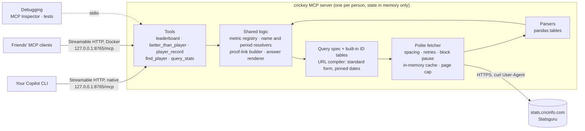

# Plan: `crickey`, an MCP server for Cricinfo Statsguru

## Goal
- Answer cricket statistics questions using only Cricinfo's Statsguru as the data source.
- Every answer includes Cricinfo links that anyone can open to check the numbers and share as proof.
- These golden questions must work:
  1. Average number of innings taken per ODI century (minimum X number of centuries).
  2. Which players have scored Test hundreds more frequently than player X?
  3. Which batters had better average and strike rate in T20 than player X, in the same period that player X played?
  4. What was player X's Test batting average in the last Y years of his career?
  5. How many hundreds has player X scored in ODI World Cups?

## Overview
This plan says how to build crickey to meet the goal. It refers to decisions and research instead of repeating them:
- **Decisions:** [decisions.md](decisions.md), referred to by number (D1, D2, …).
- **Research facts:** [research.md](research.md), referred to by section as R1–R16.

## Versions
R15 lists the versions to use (D22).
- `pyproject.toml` sets `requires-python` to R15's Python minor version and, for each dependency, a lower bound at its R15 version (lower where D27 says so) and an upper bound below its next major version.
- Actions are pinned to the commit SHAs of R15's releases.

## Architecture

## Statsguru coverage (`query_stats`)
`query_stats` exposes Statsguru's own basic and advanced forms for every stat type, with Statsguru's field names and values (R4) and its minimum and sort options (R5). Nothing is renamed or regrouped. It accepts checkbox groups as repeated values, sorted for stable URLs, and all three result qualifications that Statsguru supports (R2).

## MCP tools (v1)
Five tools (D14), all read-only.
- **Answer tools** return `answer_markdown` plus structured data. The markdown has a short answer, a table, the method and assumptions, labelled pinned links and profile links (D16), the "as of" date and the freshness line (D17).
- **Ambiguous names** (players, teams, grounds, trophies) return `needs_clarification` with the candidates.
- **Descriptions** start with example questions taken from the golden questions.

1. **`leaderboard`** (golden question 1): "Who has the best or fastest …?"
   - Parameters: format, metric, period, filters by name (team, opposition, host country, ground, trophy, home or away, match result), minimum and top N.
   - Metrics can be Statsguru columns (runs, average, strike rate, hundreds, …) or derived rates (innings per hundred, innings per fifty-plus, balls per dismissal).
   - For a derived rate it also gives the group's overall figure, for example total innings ÷ total hundreds across all qualifying players.
2. **`better_than_player`** (golden questions 2 and 3): "Who beats player X on A (and B)?"
   - Parameters: player name, format, 1–3 metrics, all or any, period (all time, X's career span, or dates), minimum and filters.
   - Includes X's own row. Proof link (D16): the results query with X's values as extra minimums (R2).
3. **`player_record`** (golden questions 4 and 5): one player's figures in a format.
   - Parameters: player name, format, period (whole career, first or last N years of their career, dates or season) and filters (opposition, host country, ground, trophy such as the ODI World Cup, home or away, match result).
   - Proof link: the player's Statsguru page with the same filters (R6).
4. **`find_player`**: candidates with ID, country, formats and career spans (R7).
5. **`query_stats`**: any Statsguru query (see coverage above).
   - Returns up to `limit` rows (default 50, maximum 200), the total row count, the table's columns and the pinned link.
   - With `fetch=false` it only builds the link, so no request is made.

Server instructions tell the agent to:
- prefer the answer tools and show `answer_markdown` as-is;
- not do multi-row arithmetic itself (D13);
- cite only links that came from the tools (D16);
- read "T20" as D3 says.

## Calculations (inside the answer tools)
- **Metric registry (batting first):** for each metric it records:
  - the label;
  - the Statsguru column, sort field and qualification field, if Statsguru has the metric;
  - the formula from totals, if it's derived;
  - which direction is better, and its default minimum, which is stated in answers.

  Examples: innings per hundred = innings ÷ hundreds; balls per dismissal = balls faced ÷ dismissals.
- **Ratios:** Statsguru's displayed averages and strike rates are used as they are (D15); the registry's formulas compute only the metrics Statsguru doesn't show.
- **Period resolver:**
  - "X's career span" is X's first and last match start dates in that format, from X's innings list (R6).
  - "The last Y years of X's career" runs from Y years before X's last match to that match.

## Proof links and freshness
The proof-link builder implements D16, and the answer renderer D17.
- **Pinned dates:** `spanmin1` is the format's first match date (from the built-in tables) and `spanmax1` is today, unless the question's period is narrower.
- **Unresolved career-relative periods:** query specs can carry them, but proof links are built only after they have been resolved to concrete dates.
- **Final filter in the link:** added through `qualval2` and `qualval3` (R2).
- **Freshness line:** from the results page's list of current or recent matches (R8).
- **Profile links:** built from the player ID in Statsguru's format (R6).

## Built-in IDs
- **Generator:** `scripts/gen_ids.py`, run only by developers, reads the advanced form pages (R4) for each format in D3 and writes the tables D18 lists into a committed Python module. Re-run it by hand when a team or league is added.
- **Runtime resolver:** `crickey.ids` resolves built-in team, host country, continent and trophy names by class, ignoring case, extra whitespace and punctuation. The tiers are exact normalized name (including form labels without venue prefixes or trailing edition seasons), unique initials (ignoring "of", "the" and "and"), unique name after dropping generic words (`icc`, `men's`, `cricket`, `the`) and singularizing before dropping class-restating format words (`test`, `odi`, `one-day`, `t20i`, `t20`, `international` as applicable), a unique 3+ letter word prefix, whole-word containment that keeps query words contiguous and in order for auto-matches, then fuzzy candidates; ambiguous or unknown names return ranked candidates for clarification.
- **On demand (D18):** grounds, series and `player_involve`/`captain_involve` IDs are read from the form pages (R4) when a query needs them, and kept in memory. A miss refetches the lookup page once before returning candidates, except when the cached page already has exact, acronym, generic-word or in-order whole-word containment candidates and the name is just ambiguous.
- **Parameter meanings** live in code and are tested against synthetic form pages. The involve IDs use their own `player_involve` and `captain_involve` kinds, separate from player-page IDs.

## Fetcher
Implements D7–D12 and D17.
- **Client:** httpx, with the User-Agent from D12.
- **State per process, in memory:** the rate limiter, retry state, block pause and unavailable URLs.
- **Cache:** compressed, in memory, keyed by standard URL, with D17's freshness rules and size cap; storage uses `cachetools.TLRUCache` (D28). Player search and form pages are lookups: they're kept for the life of the process and refetched once when a lookup misses.
- **Retries (D11):** after D11's waits, each further retry waits twice as long as the one before. A tool call stops retrying when the next attempt wouldn't fit in its time budget, which stays below the client timeout (300 s in the README's setup). `Retry-After` sets a "not before" time; if that's past the budget, the call fails at once with "try again after HH:MM".
- **Unavailable URLs:** a URL that returns 400 or 404 isn't requested again by the same process.
- **Time messages:** "try again after" and "paused until" use the process's local time with its UTC offset and are rounded up to the next minute.
- **Block pause (D11):** while paused, calls that need Cricinfo fail at once with "paused until HH:MM (UTC±HH:MM)", and cached pages still work. The test request after a pause comes from the next tool call that needs Cricinfo, never from the background.
- **Challenge pages:** detected only when a response has no Statsguru markers (`Statsguru`, `engineTable` or `/ci/engine/`) and does have challenge markers such as `captcha`, `challenge`, `cf-challenge`, `access denied` or `enable javascript`.
- **Requests:** the page cap (D10), checked against the total on the first page (R2), and progress notifications while waiting.
- **Tests:** a test-only hook serves synthetic pages instead of the network.
- **Settings** (environment variables, or matching flags; flags win): `CRICKEY_MIN_INTERVAL`, `CRICKEY_MAX_RETRIES`, `CRICKEY_BLOCK_PAUSES`, `CRICKEY_MAX_PAGES`, `CRICKEY_CACHE_MAX_MB`, `CRICKEY_RECENT_TTL`, `CRICKEY_PORT` and `CRICKEY_IN_CONTAINER`. `CRICKEY_MAX_RETRIES` counts retries after the first attempt, and `0` turns them off. Durations use seconds by default or an `s`, `m` or `h` suffix; block pauses are a comma-separated list of durations.

## HTTP transport
- **Serving:** `crickey serve`, which plain `crickey` also runs, serves `mcp.streamable_http_app()` with uvicorn on port 8765 (`--port` or `CRICKEY_PORT`), as one process. This is the default mode (D20).
- **Binding:** natively it binds 127.0.0.1 and rejects other addresses. With `CRICKEY_IN_CONTAINER=1`, which the image sets, it binds 0.0.0.0 inside the container (D20).
- **Host/Origin checks:** an allowlist through `TransportSecuritySettings` with `127.0.0.1:*`, `localhost:*` and `[::1]:*` (R12; D20). No CORS.
- **Other:** responses stream as SSE, the SDK default, so progress notifications arrive (R12); `/health` returns only `{"status": "ok"}`; startup checks that the port is free.
- **stdio (debugging only, D20):** `crickey stdio` runs the same server over stdio for the MCP Inspector (`mcp dev`, R12) and tests.

## Docker image
- **Image:** `ghcr.io/<you>/crickey` for the architectures in D24, tagged `<version>`, `<major>.<minor>` and `latest`.
- **Dockerfile:** multi-stage.
  - The build stage uses uv to install crickey and its dependencies into a virtual environment and precompiles bytecode. The package index follows D23; local builds can override it through a BuildKit secret.
  - The final stage is R15's slim Python base image with only that environment, running as a non-root user.
  - `ENTRYPOINT ["crickey"]`, default command `serve`, `CRICKEY_IN_CONTAINER=1` and `PYTHONDONTWRITEBYTECODE=1`. No `VOLUME`.
  - OCI labels for the source repo, a description with the disclaimer (D6) and the licence (D25).
  - A `.dockerignore` keeps tests, caches and research data out.
- **Read-only:** it runs with `--read-only`, which D19 makes possible.
- **Usage:**
  - HTTP (default): `docker run -d --rm --read-only --name crickey -p 127.0.0.1:8765:8765 ghcr.io/<you>/crickey:<version>`, then connect clients to `http://127.0.0.1:8765/mcp`. After a reboot, run the command again.
  - stdio, for debugging only: `docker run -i --rm --read-only ghcr.io/<you>/crickey:<version> stdio`
  - Settings are passed as `-e CRICKEY_…` environment variables.

## CI pipeline (GitHub Actions)
- **`ci.yml`** (pull requests and pushes to `main`):
  - ruff and pytest on `ubuntu-latest` and `windows-latest`, using uv with R15's Python version and public PyPI;
  - build the image for `linux/amd64` without pushing, then run a smoke test with `--read-only`: start it in its default HTTP mode, check `/health`, list tools and call `query_stats` with `fetch=false` (no network needed) through `mcp.Client` over HTTP, and check that `stdio` still lists the tools.
- **`release.yml`** (tags `v*`):
  - rerun the tests;
  - set up QEMU and Buildx, and log in to GHCR with `GITHUB_TOKEN` (`packages: write`);
  - generate tags and labels with `docker/metadata-action`;
  - build and push both architectures with `docker/build-push-action`, with provenance and SBOM attestations;
  - smoke-test the pushed image by digest;
  - create a GitHub Release with notes and the `docker run` command.
- **Hygiene:** actions pinned to commit SHAs, least-privilege `permissions`, and Dependabot for actions, Python dependencies and the base image.
- **One-time step:** GHCR creates new packages as private, so after the first push the package is switched to public in its settings. The `org.opencontainers.image.source` label links it to the repo.

## README
The README's commands use Bash syntax. It covers:
- the disclaimer (D6);
- the image name and tags;
- the `docker run` command, which starts the HTTP server published on loopback only, and that it must be running before clients connect (run it again after a reboot);
- one generic JSON snippet with the URL `http://127.0.0.1:8765/mcp`, and the Copilot CLI one-liner (`copilot mcp add --transport http --timeout 300000 crickey http://127.0.0.1:8765/mcp`);
- the environment variables;
- why requests are slow (D9), that the cache resets when the container stops (D19), and that one container should serve all your clients (D20);
- one line on `stdio` for debugging.

## Work items
The work is split into [GitHub issues #1–#18](https://github.com/syedhassaanahmed/crickey/issues), one per session. Each is a user story with acceptance criteria and "blocked by" links. Issues labelled `needs-owner` include steps only the owner can do. [AGENTS.md](../AGENTS.md) explains how a session picks and finishes one.

## Testing
- **Unit tests:**
  - URL compiler golden tests, spec validation, and parsers on synthetic fixtures (including the "current or recent matches" note).
  - Built-in ID tables: their format, lookups, and the fallback to form pages.
  - Metric formulas, and ties between equal displayed values.
  - Name resolution and clarification, and the period resolver (career span; first or last N years).
  - The fetcher: rate limiter, page cap, retries (`Retry-After`, jitter limits, time budget), pauses after a block, unavailable URLs, the cache size cap and the freshness rules.
- **Answer tools:** each one against synthetic pages, with expected answers and proof links.
- **HTTP tests:** Host and Origin checks (localhost on any port), loopback-only binding natively, binding in container mode, and SSE progress.
- **End to end:** tests over HTTP and stdio using the synthetic-page hook, a check that no files are written, and the `--read-only` container smoke test. CI runs on Ubuntu and Windows. Live smoke tests run only when explicitly enabled.
- **Acceptance:** the five golden questions are answered correctly with both models, every pinned link shows matching numbers, and the public image works on a machine without the source.

## Risks and open items
- **Small tool set (D14):** questions outside the three answer tools go through `query_stats`, which a weak model may struggle with.
- **Built-in IDs go stale slowly:** new teams or leagues are missing until the generator script is re-run. The on-demand form lookup covers the gap.
- **Speed:** D9's spacing makes uncached multi-step answers slow. Mitigations: answer tools keep the number of requests low, plus caching, progress notifications and longer client timeouts.
- **No authentication (D20):** any program running on the machine can call the HTTP server. In Docker, publishing the port beyond loopback would expose it to the network; the README only shows loopback publishing.

## Out of scope for v1
Everything decisions.md excludes: the "Considered and dropped" table, plus the exclusions in D3, D7 and D8.
